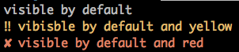
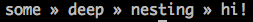

# [uilog][]

[](https://travis-ci.org/michaelcontento/uilog)
[](https://david-dm.org/michaelcontento/uilog)
[](https://david-dm.org/michaelcontento/uilog#info=devDependencies)

[](https://www.npmjs.com/package/uilog)
[](https://www.npmjs.com/package/uilog)
[](https://www.npmjs.com/package/uilog)

## Overview

Use this module to create somewhat pretty CLI apps (like [Avalon][]).

### Simple output

You can log at various levels:

```js
import { debug, info, warn, error } from 'uilog';

debug('hidden by default');
info('visible by default');
warn('vibisble by default and yellow');
error('visible by default and red');
```



Use `setVerbose(true)` to change the visiblity of `debug` rows.

### Async output

But it's also possible to log async tasks with a spinner! They do follow the
same visibility / styling rules as the normal logging functions.

```js
import { debugWait, infoWait, warnWait, errorWait } from 'uilog';

const ok = infoWait('Processing ...');
setTimeout(ok.done, 3000);

const error = warnWait('Waiting for a lock to be released ...');
setTimeout(error.error, 2000);

const hide = errorWait('Waiting for required clients ...');
setTimeout(hide.clear, 1000);

const download = infoWait('Downloading a file ...');
setTimeout(() => download.setProgress(5), 0);
setTimeout(() => download.setProgress(10), 500);
setTimeout(() => download.setProgress(20), 1000);
setTimeout(() => download.setProgress(30), 1500);
setTimeout(() => download.setProgress(40), 2000);
setTimeout(() => download.setProgress(50), 2500);
setTimeout(() => download.setProgress(60), 3000);
setTimeout(() => download.setProgress(70), 3500);
setTimeout(() => download.setProgress(80), 4000);
setTimeout(() => download.setProgress(90), 4500);
setTimeout(() => download.setProgress(100), 5000);
setTimeout(download.done, 5250);
```


### Nesting

With `namespace` you can create arbitraty deeply nested log output:

```js
import { namespace } from 'uilog';

namespace('some')
    .namespace('deep')
        .namespace('nesting')
            .info('hi!');
```



## Installation

    npm install --save uilog

  [Avalon]: http://avalon.michaelcontento.de
  [uilog]: https://github.com/michaelcontento/uilog
